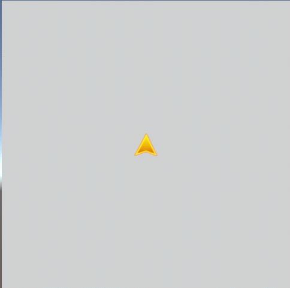
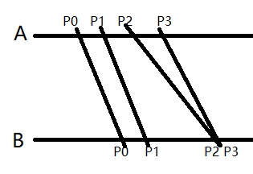
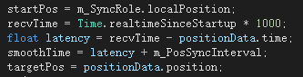
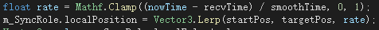
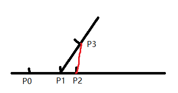
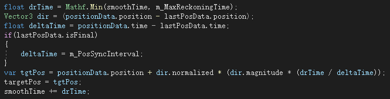
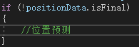
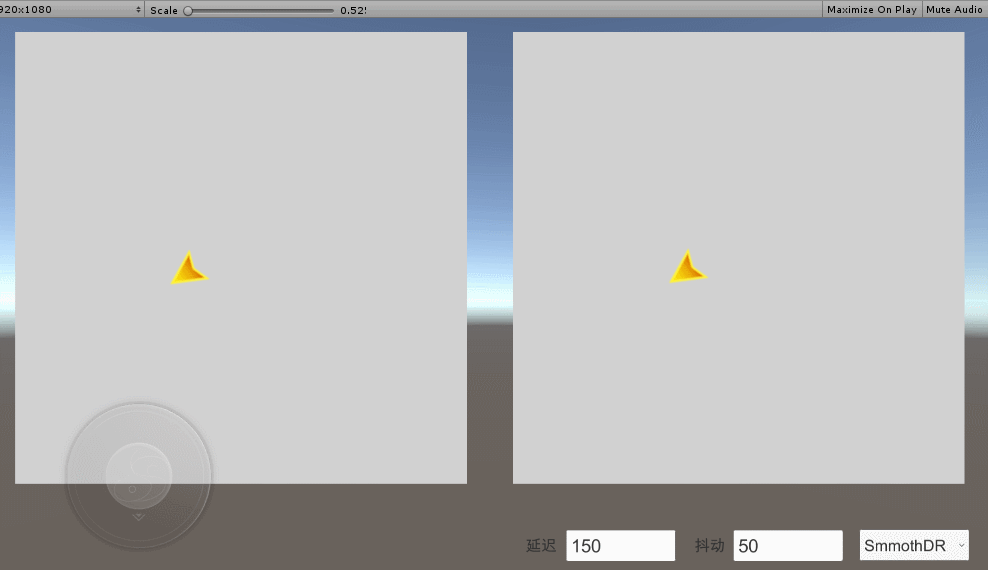

@(Unity)[位移同步, MMO, 航位预测, DR, mmo]

参考了云风和一些其他的资料，做了一个Demo，大概效果还行，先贴一段录屏。

2024/07/28修改了模拟发送位置延迟波动时后发的点可能会先到的bug， 并把两个画面合并，添加了一个拖尾轨迹，看起来效果更清晰一些。

---
为了保证主客户端的操作体验，一般会采取客户端先行的做法，也就是按下移动键的时候，客户端直接就开始位移了，然后再按照一定频率上报当前坐标给服务器，服务器校验坐标的合法性，如果不合法就另发一条消息把客户端强行拉回先前的位置。如果合法，就把这个坐标广播给其他客户端。
我看网上的一些资料的做法会在服务器收到客户端的坐标后 按照时间差在服务器上做一个位置预测，然后广播的是服务器预测后的一个位置，感觉这里没有必要，因为预测本身就很可能是错误的，服务器做预测岂不是很可能直接就发送了一个错误坐标到客户端，然后其他客户端按照这个错误坐标做同步，感觉这里面坑挺深的。于是我采取服务器不做预测，直接广播主客户端当前坐标，这样其他客户端收到的坐标至少是正确的，然后在此基础上在做预测。

###主要的一些问题
1.由于是客户端按照预定频率上报当前的坐标，服务器进行广播，那么其他客户端收到的坐标都是已经发生了的点，并且在收到时候主客户端很可能已经不在这个位置了。试想这样的场景：
客户端A在T0时刻上报了自己的坐标P0，服务器广播后，客户端B在T1时刻收到了A在P0位置的消息，但是由于A一直在保持运动，所以实际上T1时刻A已经运到到了P1位置，所以第三方客户端同步的时候的数据信息总是滞后的。
2.由于网络延迟和抖动的问题，尽管主客户端按照一个固定频率上报自己的坐标，但是第三方客户端收到的同步坐标数据还是极有可能是不连续的，有可能间隔很长时间才收到下一个同步位置，也有可能一次收到好几个坐标。

关于坐标滞后导致的一些游戏逻辑问题，比如攻击命中的判定问题等，一般是以服务器数据为判定依据，对于这种临界坐标的判定，还有一些服务器根据时差记录历史坐标，或者直接按照Miss判定未命中等办法直接盖过，只要延迟不是很严重，效果一般也还能接受，并且MMO在这方面自带容错。所以逻辑判定还是以服务器为主，客户端主要做表现。
###平滑插值
由于第三方客户端收到的坐标都是非连续的，并且是主客户端按照某个时间间隔上报的，所以如果收到坐标后直接赋值，表现上看起来就是连续的瞬移和拉扯，这在上报频率高，网络抖动小的情况下可能效果还好，但是频繁上报消息本身是可不可取的做法，并且网络抖动的问题也是不可控。所以为了表现上平滑，不至于瞬移，一般采取坐标插值的做法，把位置变化的过程分摊到一小段时间或是几帧里面。
**关于坐标上报频率，我采取的是每100ms 或是 坐标 或 角度 变动超过一定阈值才上报。**
关于插值方案，我选择了最简单的线性插值，感觉效果也够用，网上还有一些其他的插值算法，可能效果会更平滑一些把。
具体做法：
***首先需要选取一个插值时间也即每个同步点的一个平滑时间。***
考虑到客户端收到的每个同步坐标都有一个延迟时间，并且主客户端上报坐标的频率是100ms，那么就可以假设，如果网络延迟稳定，第三方客户端将会每隔一个延迟时间+100ms收到一个同步点，平滑时间选取为 延迟时间latency + 100ms，就能达到连续的平滑效果。然而网络延迟时间总是不稳定的，每次的延迟时间总是不同，但是我们可以简单地认为就近的两条消息的延迟是比较接近的，也就是 收到一个同步点之后，计算出当前延迟Latency，然后认为下一个点也将在这个延迟时间 + 100ms 之后到达， 于是就可以直接选取当前延迟时间+同步频率 作为每次的平滑时间。

然后按照平滑时间在Upadate里做插值即可。

感谢xp同学评论指出上方关于"如果网络延迟稳定，第三方客户端将每隔一个延迟时间+100ms收到一个同步点..."的错误，实际如果延迟稳定，后续应该直接每隔100ms收到同步点，不过这里我仍然选取了当前延迟作为平滑补偿。因为延迟会有波动，后续点不会按照100ms间隔收到，可能会早于100也可能晚于100，还可能前后几个点同时到达，这个平滑时间抠的太小的话反而会导致同步位移一顿一顿。选当前延迟作为补偿不会导致平滑时间太长进而造成位移缓慢，也不太容易因为太短而造成卡顿，所以我认为选这个还是比较合适的。

---

#####但是由于网络抖动的问题存在，延迟时间总是不稳定的，很有可能发生当前点已经平滑到达了，但是下一个点还没有收到的情况，这样就容易出现位移的时候走走停停，断断续续的问题。试想角色位移的时候 位移动画刚播了没1秒钟，角色就停下来了，然后过了一会又接着走。 并且连续的不稳定的话还有可能出现位移动画走步，滑步等问题。
###航位预测
解决这个问题的办法是在没有收到下一个同步点的时候，客户端自己做一个位移预测，让角色保持位移的状态，客户端简单地认为角色会保持当前的位移方向和速度继续运动（事实上也确实是保持运动状态的情况居多，变化居少），预测下一个同步点的位置。尽管位移预测的值经常是错误的，但是对于客户端表现来说，我们要的并不是精确的坐标值，而是角色不要停。当预测坐标发生偏差的时候，再以插值的方式从偏差位置走回后续收到的正确位置即可，只需要保证最终位置正确，而中间过程差异不要太大即可。

即有可能发生上图的情况，P2为经过P1同步后预测的一个点，而后续收到的真实位置在P3，对于这种情况，首先可以给坐标预测设置一个上限，这样不至于导致预测结果偏差太多，然后再偏差位置直接插值纠正到正确的P3位置即可。
***关于预测值计算方式***
网络上的资料大多都是选取了角色移动速度，然后自定义一个预测时间，按照当前位移方向计算出的一个预测位置，个人感觉这种方式出现偏差的可能性比较大，而且偏差的值也会比较大。我采取的是按照 当前同步点和上一次同步的点，即上图中的P1 和 P0，作为就近一次的同步状态（因为考虑网络和角色本身移动状态都是一个连续的过程，选取时间上最近的状态可能会更准确），然后还是按照选取插值时间的办法，认为下一个同步点的到达是在一个延迟latency + 同步频率interval(100ms) 之后，按照这个时间，比对P1和P0的时间差，按比例计算一个距离作为预测值。

做了预测之后的插值时间记得要加回预测占去的时间drTime。
#####关于最后一个点不做预测
之前经常发生进行同步的时候，第三方客户端上的角色最终停止的位置会比主客户端多走了几步的问题，这时因为对最后一个同步坐标也做了预测的缘故。 这里我们可以同步的数据包上加一个标记，标记当前点是否为终点，或者主客户端在发送完最后一个坐标之后立马再上报一条角色停止的消息，标记角色当前已停止位移，不需要再做预测。

一般情况下角色在收到终点坐标还没有开始做预测的情况居多一点，或者已经做了预测，但是预测值没有超过最后一个坐标，但是也会有收到最后一个点的时候，角色已经做了预测，并且走超了的情况，这种情况只能按照终点坐标做一个会拉的操作了，或者客户端设定了预测上限，在偏差值不大的情况下允许这种偏差存在也可以。
#####所以这种做法还是会出现客户端角色被回拉的情况的。
最终效果：

参考：
https://blog.codingnow.com/2012/03/dev_note_12.html
http://www.zhust.com/posts/%E7%BD%91%E7%BB%9C%E6%B8%B8%E6%88%8F%E7%9A%84%E7%A7%BB%E5%8A%A8%E5%90%8C%E6%AD%A5%E4%BA%8C%E7%8A%B6%E6%80%81%E6%9B%B4%E6%96%B0%E5%8F%8A%E8%88%AA%E4%BD%8D%E9%A2%84%E6%B5%8B%E6%B3%95/

